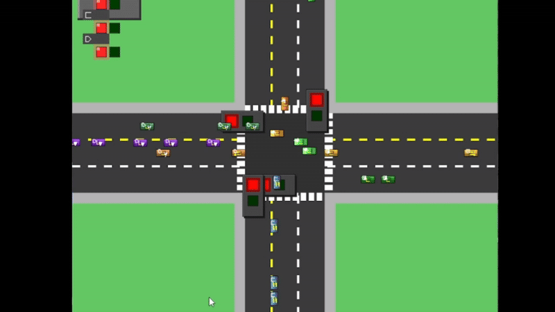

## DSA Queue Simulator - Traffic Light System


A C++/SDL3 implementation of a traffic light queue management system for COMP202 Data Structures and Algorithms assignment.

## 📋 Description
Simulation of a traffic junction management system using queue data structures. Features:
- Priority-based vehicle queue management
- SDL3 graphical visualization
- Traffic light state management
- Vehicle generation system
- Lane prioritization logic

## 🚥 Intersection Flow Manager

A comprehensive simulation system modeling traffic flow at a four-way intersection using queue-based data structures and intelligent traffic management algorithms.



## 🛣️ Project Synopsis

This simulation recreates a realistic traffic intersection where vehicles navigate according to lane-specific rules and traffic signal patterns. The project showcases practical applications of theoretical queue data structures in solving real-world traffic management challenges.

### 💡 Core Capabilities

- **Queue-Driven Traffic Flow Control**: Demonstrates how linear data structures can efficiently model vehicle movement
- **Specialized Lane Configuration**:
  - **Standard Lanes**: Vehicle movement controlled by traffic signal timing
  - **Smart Priority Lane (A2)**: Automatically receives precedence when congestion exceeds 10 vehicles, until queue reduces to fewer than 5
  - **Always-Open Left Turn Lanes (L3)**: Permits left turns regardless of main signal state
- **Adaptive Signal Timing**: Light duration intelligently adjusted based on current traffic density
- **Lifelike Vehicle Behavior**: Accurate simulation of vehicle queueing, movement, and turning patterns

## ⚙️ Technical Architecture

The simulator employs these structures and algorithms:

### 🧩 Core Data Structures
- **Standard Queue Implementation**: First-in-first-out vehicle management per lane
- **Enhanced Priority Queue**: Advanced lane management with dynamic priority values
- **Navigation Waypoint Network**: Guides vehicles through intersection paths

### 🔄 Key Algorithms
- **Adaptive Signal Timing Formula**: `Duration = |V| * t` where:
  - `|V|` = Weighted average of waiting vehicles = `(1/n) * Σ|Li|`
  - `n` = Total standard lane count
  - `t` = Per-vehicle processing time (2 seconds)
- **Intelligent Congestion Management**: Lane A2 triggers priority status at >10 vehicles, maintaining it until <5
- **Independent Left Turn System**: Lane 3 vehicles bypass main signal constraints for left turns

## 📋 System Requirements

- Modern C++ compiler with C++17 support (GCC 8+, Clang 7+, or MSVC 19.14+)
- CMake 3.15 or higher
- SDL3 graphics library

## 🔨 Build Process

### Setting Up SDL3

Since SDL3 is currently in development stage, here's how to build it from source:

#### For Linux Users
```bash
# Get development dependencies
sudo apt-get update
sudo apt-get install build-essential git cmake

# Fetch SDL3 source
git clone https://github.com/libsdl-org/SDL.git -b SDL3
cd SDL

# Configure and build
mkdir build && cd build
cmake .. -DCMAKE_BUILD_TYPE=Release
make -j$(nproc)
sudo make install

#### For Mac Users
```bash
# Install tools via Homebrew
brew install cmake git

# Get SDL3 source
git clone https://github.com/libsdl-org/SDL.git -b SDL3
cd SDL

# Configure and build
mkdir build && cd build
cmake .. -DCMAKE_BUILD_TYPE=Release
make -j$(sysctl -n hw.ncpu)
sudo make install

## 📂 Project Structure

```
dsa-queue-simulator/
├── CMakeLists.txt          # CMake build configuration
├── AaryaPathak.gif         # Demonstration animation
├── include/                # Header files
│   ├── core/               # Core simulation components
│   │   ├── Constants.h     # Simulation constants
│   │   ├── Lane.h          # Lane management
│   │   ├── TrafficLight.h  # Traffic light control
│   │   └── Vehicle.h       # Vehicle entity
│   ├── managers/           # Management classes
│   │   ├── FileHandler.h   # File communication
│   │   └── TrafficManager.h# Traffic flow control
│   ├── utils/              # Utility classes
│   │   ├── DebugLogger.h   # Logging system
│   │   ├── PriorityQueue.h # Priority queue implementation
│   │   └── Queue.h         # Basic queue implementation
│   └── visualization/      # Visualization components
│       └── Renderer.h      # SDL3 renderer
└── src/                    # Source implementations
    ├── core/               # Core components implementation
    │   ├── Lane.cpp
    │   ├── TrafficLight.cpp
    │   └── Vehicle.cpp
    ├── managers/           # Manager implementations
    │   ├── FileHandler.cpp
    │   └── TrafficManager.cpp
    ├── utils/              # Utility implementations
    │   └── DebugLogger.cpp
    ├── visualization/      # Visualization implementations
    │   └── Renderer.cpp
    ├── main.cpp            # Simulator main program
    └── traffic_generator.cpp # Traffic generator program
```

## 📝 Implementation Requirements

This project satisfies the following requirements from COMP202 Assignment #1:

1. **Linear Data Structures**:
   - Implementation of Queue for vehicle management
   - Implementation of Priority Queue for lane priority
   
2. **Traffic Conditions**:
   - Normal Condition: Vehicles served equally from each lane when traffic is balanced
   - Priority Condition: Lane A2 receives priority when it has >10 vehicles
   
3. **Lane Rules**:
   - L1: Incoming lane (vehicles arrive here from other roads)
   - L2: Regular lane that follows traffic light (can go straight or turn left)
   - L3: Free lane that always allows left turns regardless of light state


